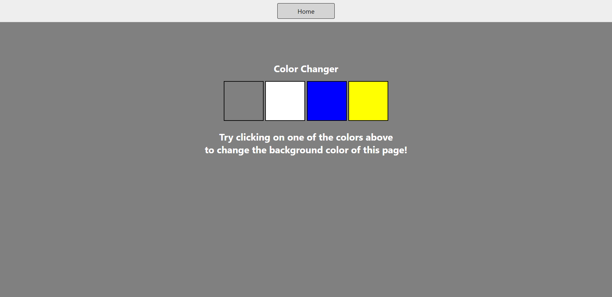
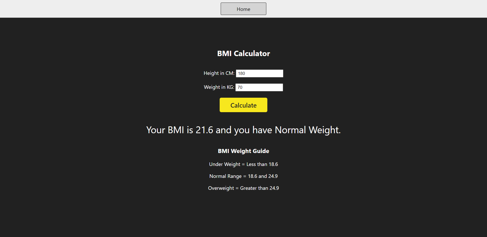
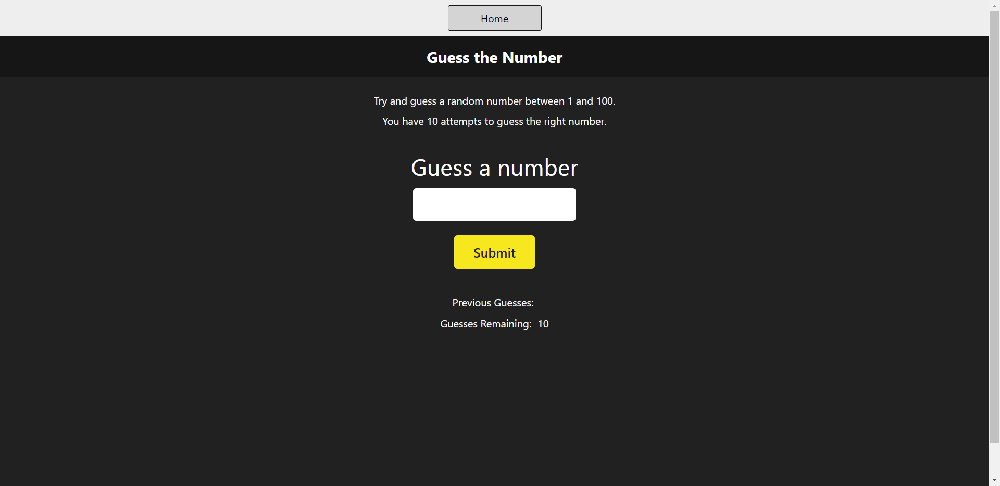
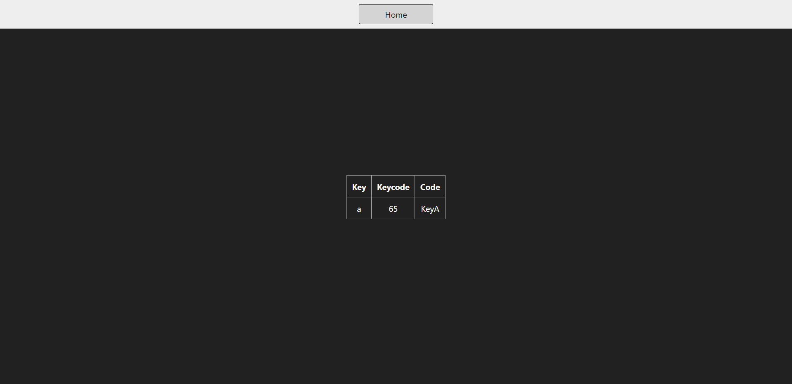
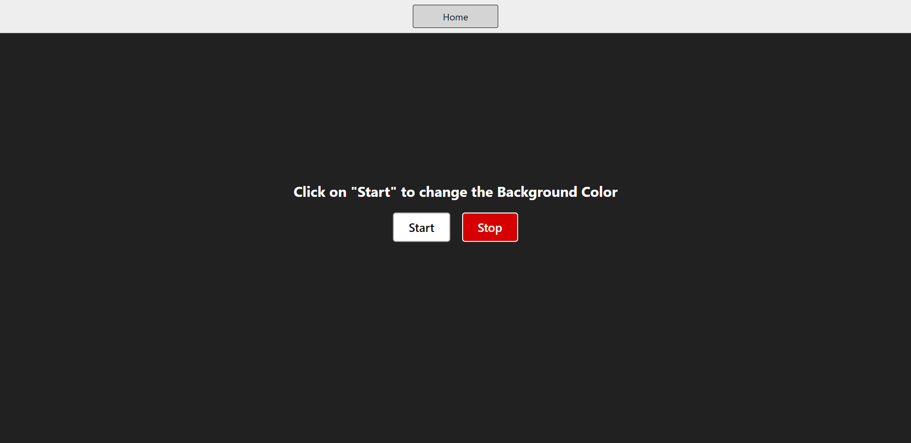

# JavaScript Projects
Hi, in this repository you'll find a variety of projects that showcase what JavaScript can do in different ways. Whether you're new to programming and want simple projects to practice, or you're curious about JavaScript's capabilities, you're in the right place. I've created these projects to showcase what I've learned, and they're here for you to explore and enjoy!"

Built with:

  

 

# Project 1:
"Color Changer" project.
- ### Output:
  

# Project 2:
"BMI Calculator" project.
- ### Output:
  

# Project 3:
"Digital Clock" project.
- ### Output:
  

# Project 4:
"Guess the Number" project.
- ### Output:
  

# Project 5:
"Keyboard Check" project.
- ### Output:
  

# Project 6:
"Unlimited Colors" project.
- ### Output:
  